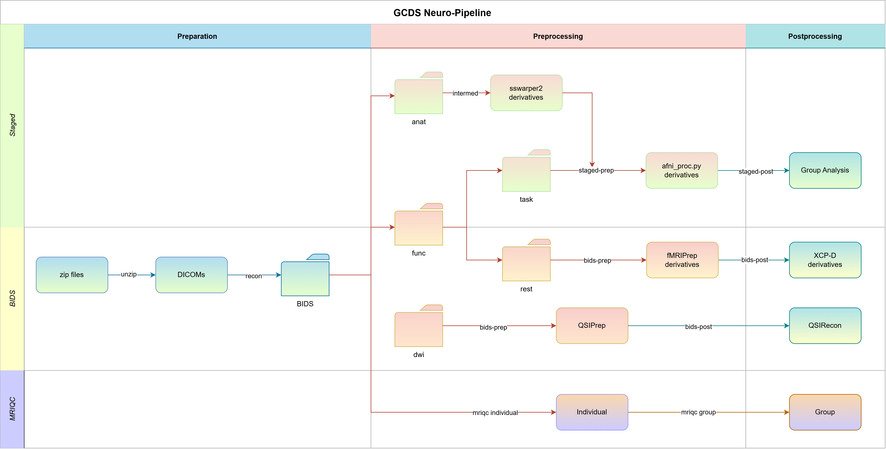

# Complete Pipeline Walkthrough

The pipeline is structured as a DAG of tasks. You choose which tasks to run via CLI flags; the pipeline resolves dependencies and submits them as SLURM jobs in the correct order. Each task generates a wrapper script that carries all parameters as environment variables to the compute node so that you do not need to hard-code paths or tool versions in your analysis scripts.



---

## 1. Configure

Run `neuropipe init` once to create a config directory with template files:

```bash
neuropipe init /scratch/my_study --project my_study
```

Then edit the two per-project files inside the generated config directory:

- **`project_config/{project}_config.yaml`** — HPC module names, container paths, and task parameters (e.g. `blur_size`, `remove_TRs`).
- **`results_check/{project}_checks.yaml`** — expected output files per task, used by `--resume` and `check-outputs` to determine which subjects are complete.

`hpc_config.yaml` and `config.yaml` at the root of the config directory are cluster-wide and shared across all projects; set them up once when deploying on a new cluster.

See [Project Config Guide](../configuration/project-config.md) and [Output Checks Config](../configuration/output-checks.md). For the shared configs, see [HPC Config](../configuration/hpc-config.md) and [Pipeline Config](../configuration/pipeline-config.md).

:::{note}
**Project name is automatically appended to output and work paths.**
`--output /data/processed --project my_study` → data goes under `/data/processed/my_study/`.
`--work /data/work --project my_study` → logs and database go under `/data/work/my_study/`.
:::

---

## 2. Detect subjects

```bash
neuropipe detect-subjects /data/raw --prefix "sub-" --output subjects.txt
```

This scans a directory for subject folders and writes bare IDs (prefix stripped) to a file, e.g. `sub-001` → `001`. Pass these to `--subjects subjects.txt` in all subsequent commands. The pipeline re-applies the prefix internally using the `prefix` field in your project config, so each script receives `$PREFIX` and `$SUBJECT_ID` separately and constructs the full ID (`sub-001`, `001`, etc.) itself.

If your data has no prefix (folders named `001`, `002`, ...), use `--prefix ""` here and set `prefix: ""` in your project config.

See [CLI Reference](../cli-reference/index.md#neuropipe-detect-subjects).

---

## 3. Dry-run

Before submitting to the cluster, run with `--dry-run` to validate your config, generate wrapper scripts, and print the full SLURM submission plan, without queuing anything.

```bash
neuropipe run \
  --subjects subjects.txt \
  --input /data/raw --output /data/processed --work /data/work \
  --config-dir /scratch/my_study/config \
  --project my_study --session 01 \
  --prep unzip_recon \
  --intermed volume \
  --bids-prep rest,dwi --bids-post rest,dwi \
  --staged-prep cards,kidvid \
  --mriqc all \
  --dry-run
```

The `--session` flag sets the session/wave label; it is passed as `$SESSION` to every wrapper script and used as a path component when locating inputs and outputs. For longitudinal studies, re-run with `--session 02`, `--session 03`, etc.

Check the printed **DAG execution plan** to verify task order and dependencies before anything hits the cluster ([Pipeline Reference](../pipeline-reference/index.md#how-the-dag-works)). The **wrapper scripts** written to `{work_dir}/log/wrapper/` show the exact module loads, exported environment variables, and script call for each job. **Preflight errors** (misconfigured modules, missing profile names, unknown task references) are caught here and block submission.

---

## 4. Submit

Remove `--dry-run`. Preflight and BIDS validation run again automatically.

```bash
neuropipe run \
  --subjects subjects.txt \
  --input /data/raw --output /data/processed --work /data/work \
  --config-dir /scratch/my_study/config \
  --project my_study --session 01 \
  --prep unzip_recon \
  --intermed volume \
  --bids-prep rest,dwi --bids-post rest,dwi \
  --staged-prep cards,kidvid \
  --mriqc all
```

Each task is submitted as a SLURM array job (one element per subject). Downstream jobs are held with `--dependency=afterany` until all upstream jobs finish. Individual subject failures don't cancel other subjects' downstream work.

**Submitting in stages.** You don't need to submit everything at once. For initial validation, go stage by stage: submit `--prep unzip_recon`, verify the BIDS output, then submit `--intermed`/`--bids-prep`, and so on. Once the pipeline is stable for your dataset, you can submit all stages in a single command.

:::{important}
**Always submit `--bids-prep` and `--bids-post` in the same command.** The `input_from` mechanism that sets `rest_post`'s `$INPUT_DIR` to the fMRIPrep output directory only activates when the upstream task is included in the same `neuropipe run` invocation. If you submit `--bids-post rest` alone, `$INPUT_DIR` falls back to your `--input` value and your scripts run against the wrong data without any warning. The same applies to `--bids-post dwi`.
:::

*`--wait` blocks the terminal and polls until all submitted jobs finish. Only useful in automated scripts; for interactive use you don't need it.*

See [Pipeline Reference](../pipeline-reference/index.md) for per-task details (inputs, outputs, SLURM profiles).

---

## 5. Merge logs

Compute nodes write JSONL event logs in real time. Once jobs finish, merge them into the SQLite database:

```bash
neuropipe merge-logs /data/work/my_study
```

This is required before `generate-report` can show job durations and status. The database is backed up automatically before each merge. `check-outputs` checks the filesystem directly and does not need the database.

If the database is missing records after a cluster crash, use `force-rebuild` to reconstruct it from all JSONL logs including archived ones:

```bash
neuropipe force-rebuild /data/work/my_study
```

See [Logging System](../internals/logging-resume.md#merge-logs-implementation) for how merging works.

---

## 6. Verify outputs

Check that all expected output files exist for every subject:

```bash
neuropipe check-outputs \
  --project my_study --work /data/processed \
  --config-dir /scratch/my_study/config \
  --subjects subjects.txt --session 01
```

Prints a terminal summary and saves a full CSV to `{work_dir}/check_results_{timestamp}.csv`. Then generate an HTML report combining job status and output check results:

```bash
neuropipe generate-report \
  --db-path /data/work/my_study/database/pipeline_jobs.db \
  --project my_study --session 01
```

See [Post-run Verification](../how-to/post-run-verification.md) and [Output Checks Config](../configuration/output-checks.md).

---

## 7. Re-run failed subjects

Use `--resume` to skip subjects whose outputs already pass the output checks and resubmit only the rest:

```bash
neuropipe run \
  --subjects subjects.txt \
  --input /data/processed --output /data/processed --work /data/work \
  --config-dir /scratch/my_study/config \
  --project my_study --session 01 \
  --intermed volume \
  --resume
```

The pipeline prints which subjects are being skipped and which are being resubmitted. See [Rerunning Subjects](../how-to/rerun-subjects.md).
