# GUI Reference

The web-based GUI provides the same functionality as the CLI — submitting jobs, editing config files, monitoring results — through an interactive dashboard.

```bash
neuropipe-gui                 # default port 8050
neuropipe-gui --port 8051     # if 8050 is already in use
```

Open `http://localhost:8050` in your browser. The GUI has three top-level tabs:

| Tab | Purpose |
|-----|---------|
| **Analysis Control** | Configure and submit pipeline jobs |
| **Project Config** | Create and edit config files |
| **Job Monitor** | Query job status, check outputs, generate reports |

---

## Typical workflow

For a first run:

1. **Project Config** → create or load your `{project}_config.yaml`
2. **Analysis Control** → select subjects, fill in paths, choose tasks, click **Generate Command**, then **Execute Pipeline**
3. **Job Monitor → Database Configuration** → click **Sync Database** after jobs finish
4. **Job Monitor → Output File Check** → verify outputs per subject
5. **Job Monitor → Generate Report** → produce HTML summary report

For re-runs after failures: go back to Analysis Control, enable **Resume Mode**, and click **Execute Pipeline** again.

---

## Analysis Control

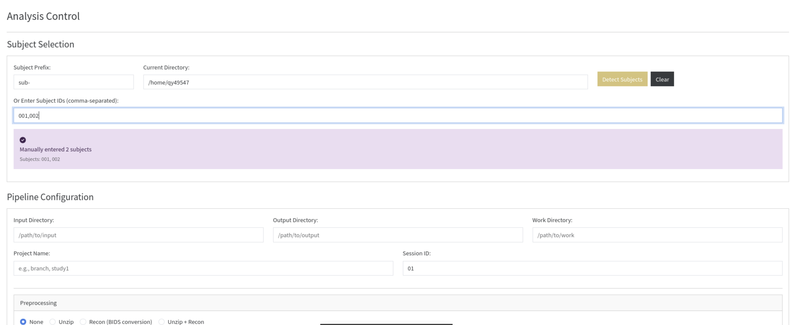

This tab is the GUI equivalent of `neuropipe run`. Configure everything here and click **Execute Pipeline** to submit.

### Subject Selection

Two ways to specify subjects:

**Auto-detect from directory** — enter the directory containing your subject folders and set the prefix (default `sub-`), then click **Detect Subjects**. The pipeline scans the directory and populates the subject list automatically.

**Manual entry** — type subject IDs directly in the comma-separated field (e.g. `001,002,003` or `sub-001,sub-002`). Both formats are accepted — the prefix is stripped automatically.

### Pipeline Configuration

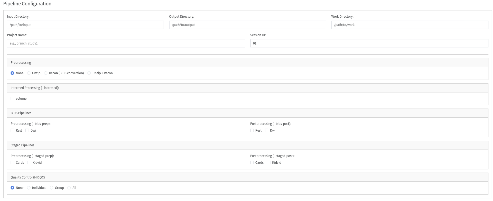

Fill in the four path fields (Input, Output, Work, Project Name) and Session ID. These map directly to the `--input`, `--output`, `--work`, `--project`, and `--session` flags of `neuropipe run`.

Task selection is broken into cards by pipeline type:

| Card | Equivalent CLI flag | Selection type |
|------|---------------------|---------------|
| Preprocessing | `--prep` | Radio buttons (None / Unzip / Recon / Unzip+Recon) |
| Intermed Processing | `--intermed` | Checkboxes (one per configured intermed task) |
| BIDS Pipelines | `--bids-prep` / `--bids-post` | Checkboxes for prep and post independently |
| Staged Pipelines | `--staged-prep` / `--staged-post` | Checkboxes for prep and post independently |
| Quality Control | `--mriqc` | Radio buttons (None / Individual / Group / All) |

Available options are populated automatically from `config.yaml` — any task sections you add there will appear here without code changes.

### Execution Control

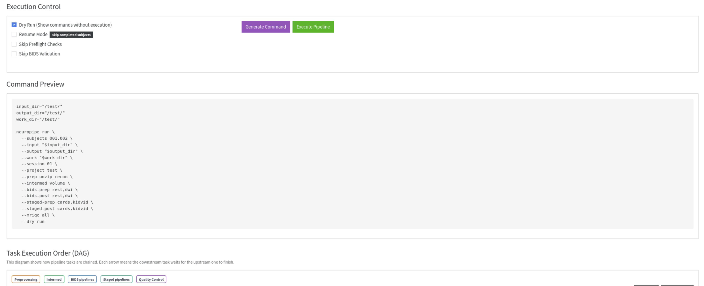

| Option | Default | Equivalent CLI flag |
|--------|---------|---------------------|
| Dry Run | **On** | `--dry-run` |
| Resume Mode | Off | `--resume` |
| Skip Preflight Checks | Off | `--skip-preflight` |
| Skip BIDS Validation | Off | `--skip-bids-validation` |

**Dry Run is enabled by default** — click **Execute Pipeline** won't submit anything until you uncheck it. This prevents accidental submissions.

Two buttons:

- **Generate Command** — builds the `neuropipe run` command from your current settings and displays it in the Command Preview panel below. No execution.
- **Execute Pipeline** — submits the jobs (or runs the dry-run if checked).

:::{important}
**Generate Command must be clicked before Execute Pipeline.** Execute Pipeline uses the stored command data from the last Generate Command call. If you change any settings after generating, click Generate Command again before executing.
:::

After clicking **Execute Pipeline**, the execution status area shows:

- **Green** — pipeline submitted successfully; stdout from `neuropipe run` is shown (job IDs, DAG plan, summary)
- **Red** — submission failed; stderr is shown for debugging
- **Yellow** — no command available; Generate Command has not been clicked yet

### Command Preview

Shows the exact `neuropipe run` command that would be (or was) executed. Copy this to reproduce the run from the CLI, save it for your records, or share it for debugging.

### DAG Visualization

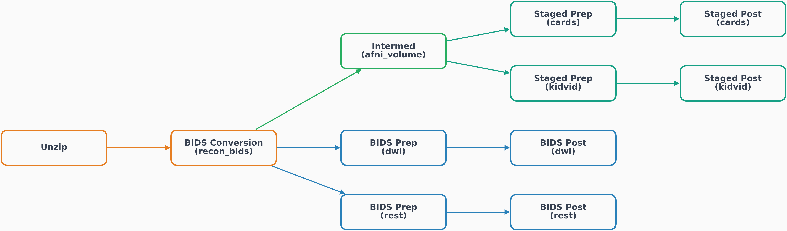

A live dependency graph that updates as you change task selections. Nodes are color-coded by pipeline type:

| Color | Pipeline type |
|-------|--------------|
| Orange | Preprocessing |
| Green | Intermed |
| Blue | BIDS pipelines |
| Teal | Staged pipelines |
| Purple | Quality Control |

Use **Reset View** to re-center the graph and **Download PNG** to save it as an image.

---

## Project Config

This tab has four sub-tabs for editing the four config files that drive the pipeline.

### Project Config sub-tab

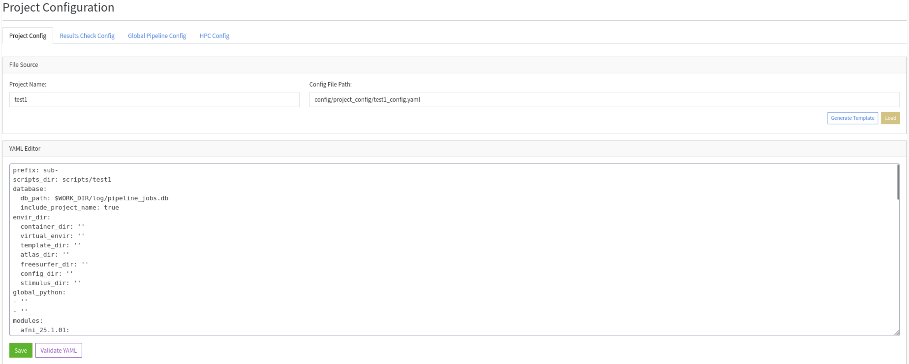

Enter a project name and the path auto-fills to `config/project_config/{project}_config.yaml`. Two entry points:

- **Generate Template** — creates a new config with all required fields and placeholder values. Start here for a new project.
- **Load** — loads an existing config file into the editor.

Edit the YAML directly in the editor, then:

- **Validate YAML** — checks syntax and required fields without saving.
- **Save** — writes the file to disk.

See [Project Config Guide](../configuration/project-config.md) for field-by-field documentation.

### Results Check Config sub-tab

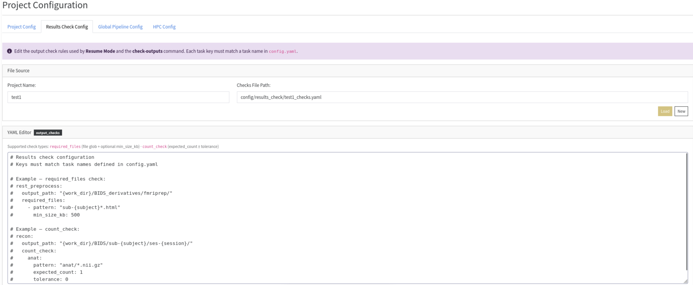

Edit the output check rules used by **Resume Mode** and `check-outputs`. Enter your project name to load or create `{project}_checks.yaml` inside `<config-dir>/results_check/`.

The editor hints show both supported check types (`required_files` with optional `min_size_kb`, and `count_check` with `expected_count` ± `tolerance`). See [Output Checks Config](../configuration/output-checks.md) for syntax details.

### Global Pipeline Config sub-tab

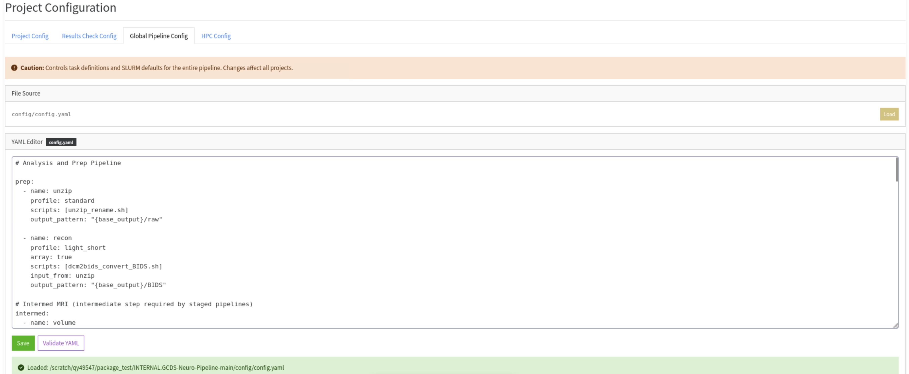

:::{warning}
Changes here affect **all projects**. This controls task definitions, SLURM resource profiles, and pipeline sections in `config.yaml`.
:::

Load, edit, validate, and save `config/config.yaml` directly. Use this when adding a new task section or adjusting resource limits.

### HPC Config sub-tab

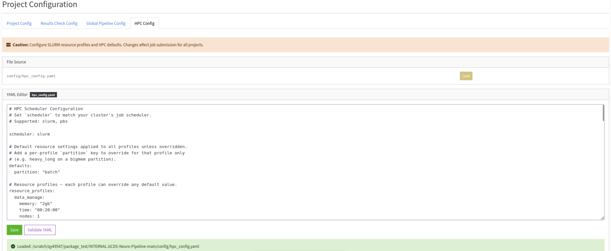

Edit `config/hpc_config.yaml` — scheduler selection, resource profiles, and SLURM/PBS flag templates. See [HPC Config](../configuration/hpc-config.md).

---

## Job Monitor

The database path and work directory are set once at the top and shared across all three tabs.

### Database tab

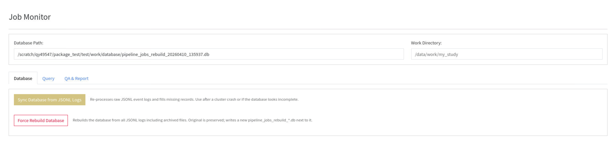

Two database maintenance actions:

- **Sync Database from JSONL Logs** — runs `neuropipe merge-logs` to populate the database from raw JSONL event files. Use this after jobs complete or if the database looks incomplete.
- **Force Rebuild Database** — runs `neuropipe force-rebuild`, which scans all JSONL logs including archived ones and creates a fresh `pipeline_jobs_rebuild_{timestamp}.db` next to the original. The original is never modified.

See [Merge Logs Implementation](../internals/pipeline-backend.md#merge-logs-implementation) for when to use each.

### Query tab

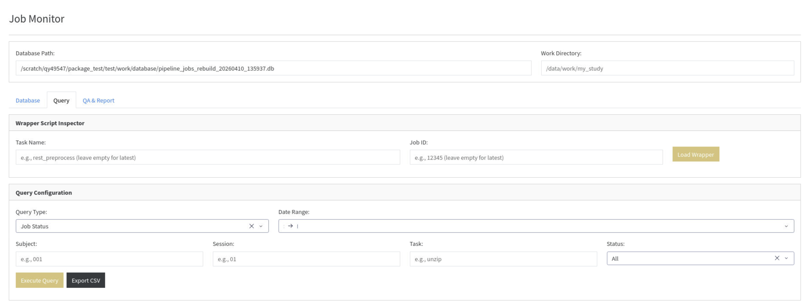

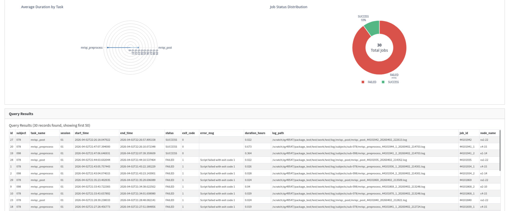

**Wrapper Script Inspector** — look up the exact wrapper script submitted for any job. Filter by task name and/or job ID (leave blank for the most recent). Shows all exported environment variables, module load commands, and the exact script call — useful for reproducing or debugging a specific submission.

**Query Builder** — query the job database directly without writing SQL. Select a query type and apply filters:

| Query type | Table queried | Use for |
|-----------|--------------|---------|
| Job Status | `job_status` | Per-subject success/failure, durations, errors |
| Command Outputs | `command_outputs` | Captured stdout/stderr for each script run |
| Pipeline Executions | `pipeline_executions` | History of all `neuropipe run` invocations |
| Wrapper Scripts | `wrapper_scripts` | Submitted wrapper content per job |

Filter by subject, session, task name, status, and date range. Click **Execute Query** to run.

Results appear as a visualization panel (charts based on query type) and a paginated table. **Export CSV** saves the current query results to a file.

### QA & Report tab

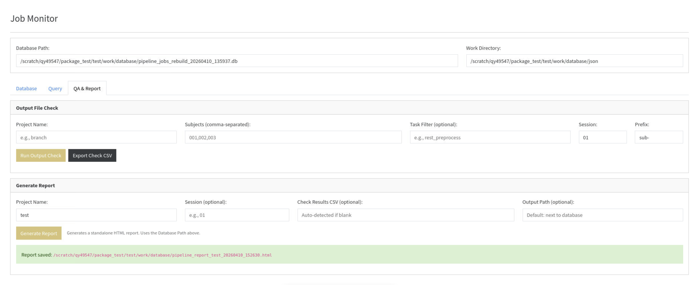

**Output File Check** — runs `check-outputs` from the GUI. Enter project name, subject list, optional task filter, session, and prefix, then click **Run Output Check**. Results appear inline. **Export Check CSV** saves the full per-subject results, equivalent to the CSV saved by `neuropipe check-outputs`.

**Generate Report** — generates a standalone HTML report from the job database. Enter the project name and optionally a session and check results CSV path (auto-detected if left blank). The output path defaults to next to the database file. See [Post-Run Verification](../how-to/post-run-verification.md#what-the-report-contains) for a description of report sections.

