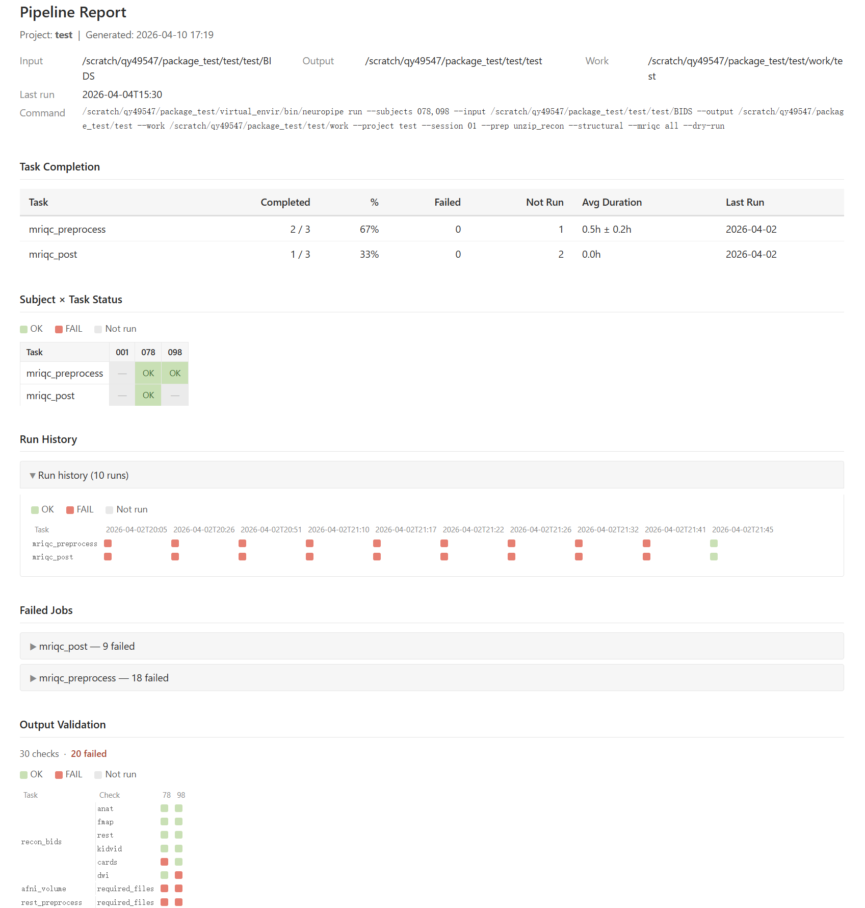

# Post-Run Verification and Reporting

Before starting, confirm your jobs are no longer running:

```bash
squeue -u $USER
```

If the queue is empty, proceed below. If jobs are still pending or running, wait for them to finish before verifying outputs.

After your SLURM jobs finish, three commands help you verify results and document what ran:

| Step | Command | Purpose |
|------|---------|---------|
| 1 | `neuropipe check-outputs` | Verify which subjects have complete outputs |
| 2 | `neuropipe merge-logs` | Sync JSONL logs into the database (if needed) |
| 3 | `neuropipe generate-report` | Generate a standalone HTML report |

Steps 1 and 3 are the most common. Step 2 is only needed if the database looks incomplete.

---

## Why you need both the database and check-outputs

After a run it is tempting to just query `job_status` and look for `FAILED` records. This catches some problems but misses others. Here is what each database status actually means and what it cannot tell you:

| Status in `job_status` | What it means | What it misses |
|------------------------|---------------|----------------|
| `SUCCESS` | The analysis script exited with code 0 | Output files may still be empty, truncated, or missing — exit 0 only means the script did not crash |
| `FAILED` | The script exited with a non-zero code | Nothing missed here — this is a real crash |
| `CANCELLED` | SLURM killed the job via SIGTERM/SIGINT/SIGHUP (timeout, node failure, user cancel) | The script may have been mid-run; outputs are likely incomplete |
| *(no record)* | The job was SLURM-cancelled before the wrapper even started (upstream dependency failed), or the wrapper itself crashed before writing its first log line | No information at all |

**The critical gap is silent failure.** An analysis tool can exit 0 while producing corrupt, empty, or partial outputs — fMRIPrep is a common example where certain failure modes produce an HTML report but no NIfTI files. The database records `SUCCESS` because the exit code was 0. Only `check-outputs` catches this by checking whether the expected files actually exist and meet minimum size requirements.

**The practical rule:**

- Database status tells you *how the job ended* — use it to find crashes and cancellations.
- `check-outputs` tells you *whether the science succeeded* — use it to confirm outputs are present and plausible.
- A subject needs to pass both: no `FAILED`/`CANCELLED` in the database **and** all check-outputs checks passing.

---

## Step 1: Check Which Subjects Completed

Before generating any report, confirm which subjects actually have valid output files on disk. This is independent of SLURM job status — a job can exit successfully but still produce incomplete output.

```bash
neuropipe check-outputs \
  --project my_study \
  --work /data/work \
  --config-dir /data/config \
  --subjects 001,002,003,004,005 \
  --session 01
```

To check multiple sessions at once, pass them comma-separated:

```bash
neuropipe check-outputs \
  --project my_study \
  --work /data/work \
  --config-dir /data/config \
  --subjects 001,002,003,004,005 \
  --session 01,02
```

If your subject list is in a file:

```bash
neuropipe check-outputs \
  --project my_study \
  --work /data/work \
  --config-dir /data/config \
  --subjects subjects.txt \
  --session 01
```

To check only specific tasks rather than all configured tasks:

```bash
neuropipe check-outputs \
  --project my_study \
  --work /data/work \
  --config-dir /data/config \
  --subjects subjects.txt \
  --session 01 \
  --task rest_preprocess \
  --task volume
```

### Reading the terminal output

The terminal shows only subjects with at least one failing check, grouped by task:

```
[check-outputs] Issues found:
  rest_preprocess: 002, 004
  volume: 004
```

This means subjects 002 and 004 are missing `rest_preprocess` outputs, and subject 004 is also missing `volume` outputs. Subjects not listed passed all checks.

A full CSV is saved automatically to `{work_dir}/check_results_{timestamp}.csv`. The CSV has one row per check item and tells you exactly which file was missing or too small — open it when the terminal summary is not enough to diagnose the problem.

### What to do with the results

- Subjects that **passed all checks** → done, move to Step 3
- Subjects that **failed** → check the SLURM logs, fix the issue, then rerun those subjects (see [Rerun Specific Subjects](rerun-subjects.md))

The `check_results_*.csv` file will also be used in Step 3 to overlay output validation status onto the HTML report.

---

## Step 2: Sync the Database (if needed)

The pipeline writes JSONL logs during each job and you merge them manually afterwards with:

```bash
neuropipe merge-logs /data/work/my_study
```

This scans `{work_dir}/database/json/` for unprocessed JSONL files, inserts them into `pipeline_jobs.db`, and moves processed files to `archived/` subdirectories.

:::{note}
`merge-logs` only processes JSONL files that contain **both** a start and an end event. A file with only a start event is silently skipped and retried on the next run. This happens in two situations:

- **Job still running** — expected; the file will be picked up after the job finishes.
- **Hard kill or node failure** — SLURM timeouts and `scancel` normally send SIGTERM first, which triggers the wrapper's signal handler and writes a `CANCELLED` end event. If SLURM escalates to SIGKILL (e.g., after the SIGTERM grace period expires) or the compute node crashes, the signal handler never runs and no end event is written. That subject will have no record in the database at all, not even a `CANCELLED` entry.
:::

If the database path is not in the default location:

```bash
neuropipe merge-logs /data/work/my_study \
  --db-path /data/work/my_study/database/pipeline_jobs.db
```

After merging, check that the database looks right before generating the report:

```bash
sqlite3 /data/work/my_study/database/pipeline_jobs.db \
  "SELECT task_name, status, COUNT(*) FROM job_status GROUP BY task_name, status;"
```

To see all jobs from a specific pipeline run (using `execution_id` to link tables):

```bash
sqlite3 /data/work/my_study/database/pipeline_jobs.db \
  "SELECT j.subject, j.task_name, j.status, j.duration_hours
   FROM job_status j
   JOIN pipeline_executions p ON j.execution_id = p.execution_id
   WHERE p.id = 1
   ORDER BY j.task_name, j.subject;"
```

`pipeline_executions.id` is the SQLite row number shown by `SELECT id, execution_time, command_line FROM pipeline_executions ORDER BY execution_time DESC LIMIT 5;`.

### If the database is missing records after a run

If jobs appear to have run but are not showing up in the database, the JSONL files are still in `{work_dir}/database/json/`. Run `merge-logs` to bring them in.

### Rebuilding the database from scratch

If the database file is corrupted or you want a clean copy that includes all historical runs (including previously archived JSONL files), use `force-rebuild`:

```bash
neuropipe force-rebuild /data/work/my_study
```

This creates a new `pipeline_jobs_rebuild_{timestamp}.db` next to the original. The original database is never modified. The rebuild scans both active and archived JSONL files, so it recovers the full history.

---

## Step 3: Generate the Report

Generate a standalone HTML report from the job database. `--check-results` is required — run `check-outputs` first (Step 1) to produce the CSV:

```bash
neuropipe generate-report \
  --db-path /data/work/my_study/database/pipeline_jobs.db \
  --project my_study \
  --session 01 \
  --check-results /data/work/my_study/check_results_20260401_120000.csv
```

The report is saved as `pipeline_report_{project}_{timestamp}.html` next to the database. To save it elsewhere:

```bash
neuropipe generate-report \
  --db-path /data/work/my_study/database/pipeline_jobs.db \
  --project my_study \
  --session 01 \
  --check-results /data/work/my_study/check_results_20260401_120000.csv \
  -o /data/reports/my_study_wave01.html
```

### Including check-outputs results



The `--check-results` path must point to a `check_results_*.csv` produced by `check-outputs`. Pass the file saved in Step 1 directly:

### What the report contains

The report is organised by session. Each session gets its own section in the navbar and contains all sub-sections below.

| Section | Description |
|---------|-------------|
| **Header** | Project, session, generation time, last run time, input/output/work paths, full command line |
| **Task Completion** *(per session)* | Table: each task's completed / failed / not-run counts, completion %, average runtime (mean ± std), last run date |
| **Subject × Task Status** *(per session)* | Colour-coded table — green = SUCCESS, red = FAILED, grey = not run |
| **Run History** *(per session)* | Collapsed. Task × Run colour-block matrix (worst-case status per task per run). Only shown when more than one run exists |
| **Failed Jobs** *(per session)* | Collapsed per task: subject, exit code, start time, stdout snippet |
| **Output Validation** *(per session)* | Compact colour-block matrix (rows = check type grouped by task, columns = subjects). Only shown when check-results data is available. Failed checks expandable in a detail table below |
| **Environment & Reproducibility** *(per session)* | Collapsed. The SLURM command, modules, env vars, and execute command from the latest wrapper script for each task |

<!--  -->

---

## Putting It All Together

A typical post-run workflow for a completed session:

```bash
WORK=/data/work/my_study
DB=$WORK/database/pipeline_jobs.db
SUBJECTS=subjects.txt
SESSION=01
PROJECT=my_study

# 1. Verify outputs — saves check_results_<timestamp>.csv to $WORK
neuropipe check-outputs \
  --project $PROJECT \
  --work $WORK \
  --subjects $SUBJECTS \
  --session $SESSION

# 2. Sync the database (if needed)
neuropipe merge-logs $WORK

# 3. Generate the report — pass the CSV from Step 1 explicitly
CHECK_CSV=$(ls -t $WORK/check_results_*.csv | head -1)
neuropipe generate-report \
  --db-path $DB \
  --project $PROJECT \
  --session $SESSION \
  --check-results $CHECK_CSV \
  -o /data/reports/${PROJECT}_ses-${SESSION}_report.html
```

---

## What the Database Looks Like

After a successful run and merge, the database contains records like these.

**`pipeline_executions`** — one row per `neuropipe run` call:

```
id | execution_id      | execution_time      | project   | session | status    | total_jobs
---|-------------------|---------------------|-----------|---------|-----------|----------
1  | 1746023412831     | 2026-04-30 09:03:32 | my_study  | 01      | COMPLETED | 150
2  | 1746109832145     | 2026-05-01 09:30:32 | my_study  | 01      | COMPLETED | 45
```

`execution_id` is a timestamp-based integer written into every JSONL file at submission time. It links this row to all jobs and wrappers from that run.

**`job_status`** — one row per subject per task:

```
execution_id   | subject | task_name        | status  | duration_hours | exit_code | node_name
---------------|---------|------------------|---------|----------------|-----------|----------
1746023412831  | 001     | rest_preprocess  | SUCCESS | 4.231          | 0         | node042
1746023412831  | 002     | rest_preprocess  | SUCCESS | 3.987          | 0         | node011
1746023412831  | 003     | rest_preprocess  | FAILED  | 0.041          | 1         | node017
1746023412831  | 001     | volume           | SUCCESS | 1.102          | 0         | node042
```

**`wrapper_scripts`** — one row per `sbatch` call (one per task per run, not per subject):

```
execution_id   | task_name       | job_id   | submission_time
---------------|-----------------|----------|---------------------
1746023412831  | rest_preprocess | 41693201 | 2026-04-30 09:03:35
1746023412831  | volume          | 41693202 | 2026-04-30 09:03:36
```

**`command_outputs`** — one row per subject per task, holds captured stdout/stderr (last 50 lines):

```
subject | task_name       | exit_code | job_id      | script_name
--------|-----------------|-----------|-------------|------------------------------
001     | rest_preprocess | 0         | 41693201_1  | afni_rest_preprocess.sh
002     | rest_preprocess | 0         | 41693201_2  | afni_rest_preprocess.sh
003     | rest_preprocess | 1         | 41693201_3  | afni_rest_preprocess.sh
```

---

## Common Scenarios

### "I just want to see which subjects have missing outputs"

`check-outputs` is the fastest way to confirm whether the expected files are on disk, without writing any SQL:

```bash
neuropipe check-outputs \
  --project my_study \
  --work /data/work \
  --config-dir /data/config \
  --subjects subjects.txt \
  --session 01
```

To narrow down to specific tasks:

```bash
neuropipe check-outputs \
  --project my_study \
  --work /data/work \
  --config-dir /data/config \
  --subjects subjects.txt \
  --task rest_preprocess \
  --task volume
```

### "I want to see exit codes and error messages from the database"

Query the database directly for jobs that crashed (non-zero exit code):

```bash
sqlite3 /data/work/my_study/database/pipeline_jobs.db \
  "SELECT subject, task_name, status, error_msg
   FROM job_status
   WHERE status = 'FAILED'
   ORDER BY task_name, subject;"
```

To see all non-successful jobs at once:

```bash
sqlite3 /data/work/my_study/database/pipeline_jobs.db \
  "SELECT subject, task_name, status, error_msg
   FROM job_status
   WHERE status != 'SUCCESS'
   ORDER BY task_name, subject;"
```

:::{note}
`status = 'FAILED'` means the analysis script exited with a non-zero exit code. It does **not** catch silent failures; a script can exit 0 and still produce incomplete or missing output. Use `check-outputs` to verify actual output files on disk.

Other statuses to be aware of:
- `CANCELLED` — job was killed by SLURM (timeout, node failure, upstream dependency failed)
- No record at all — job was SLURM-cancelled before the wrapper started, or the wrapper itself crashed before logging began
:::

### "I want to share the report with someone"

Use `-o` to save to a path outside the work directory:

```bash
neuropipe generate-report \
  --db-path /data/work/my_study/database/pipeline_jobs.db \
  --project my_study \
  --session 01 \
  --check-results /data/work/my_study/check_results_20260401_120000.csv \
  -o ~/Desktop/my_study_report.html
```

The HTML file is fully standalone — pure HTML and inline CSS, no external dependencies. No server or extra files needed.

### "My database seems incomplete after a run"

```bash
# Merge any unprocessed JSONL logs
neuropipe merge-logs /data/work/my_study

# Or rebuild from scratch (including archived logs) into a new file
neuropipe force-rebuild /data/work/my_study
```
