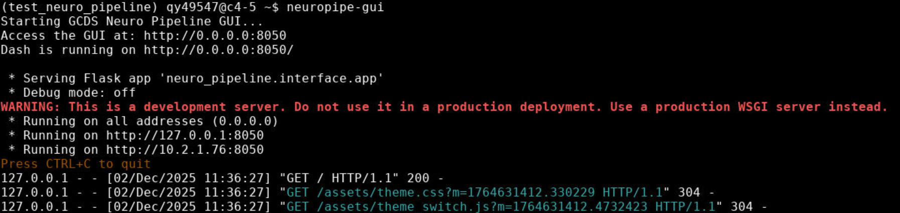
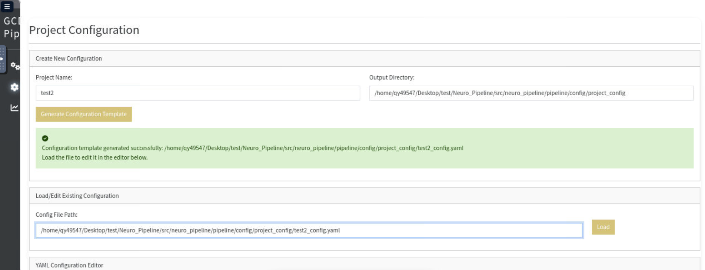
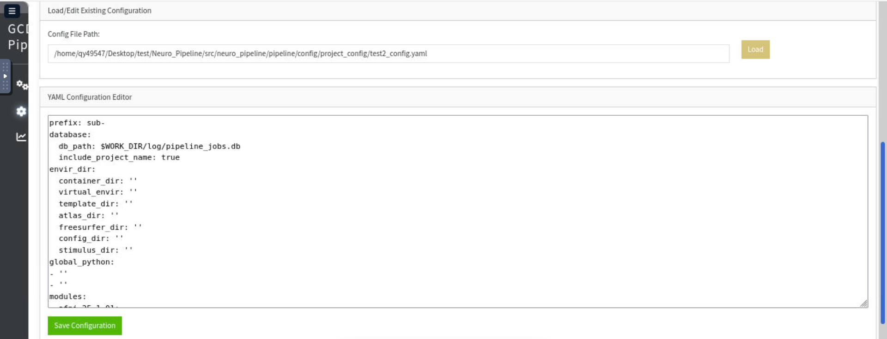
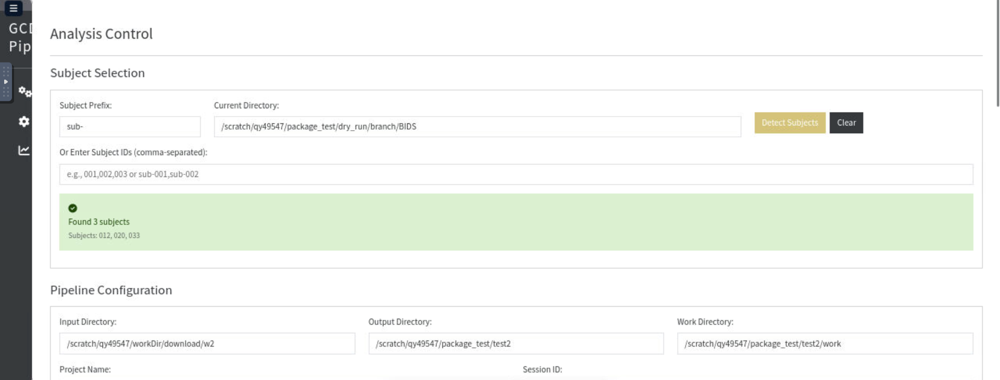
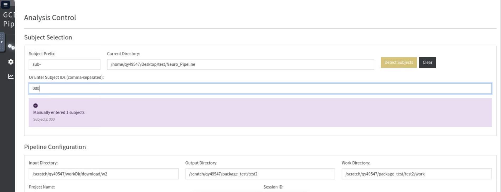
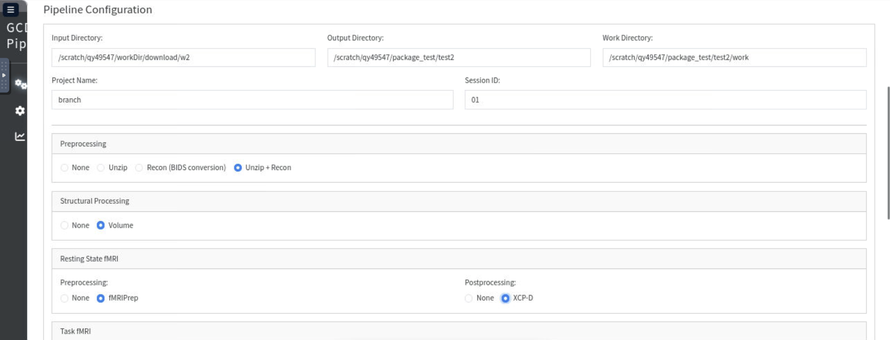
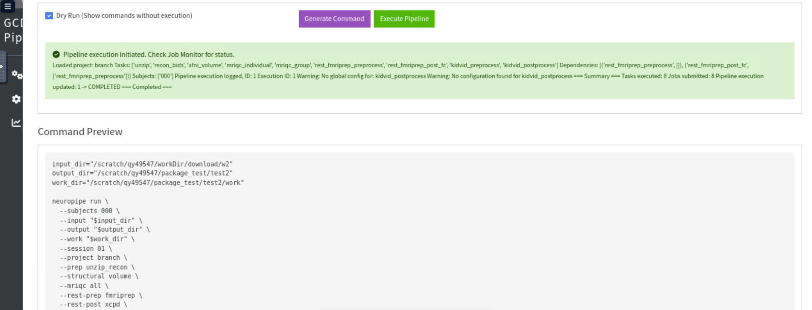
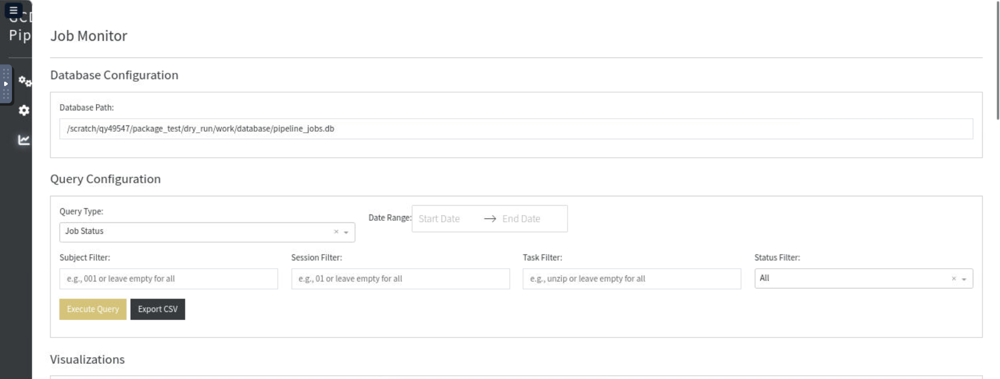
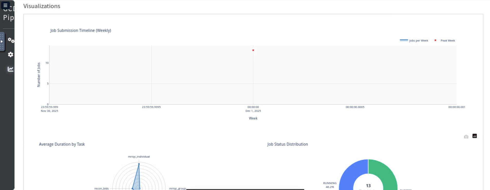
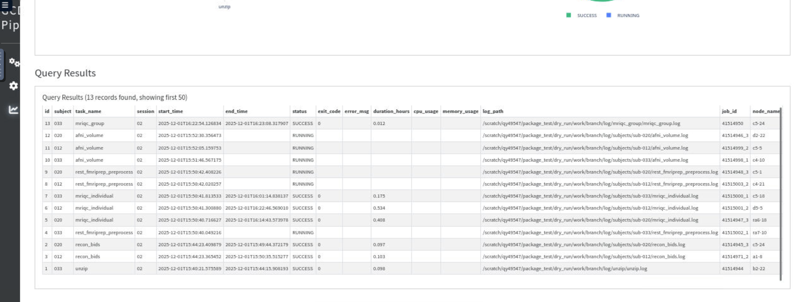

# GCDS Neuroimaging Pipeline

A comprehensive neuroimaging data processing pipeline designed for managing and analyzing fMRI and structural MRI data. This tool provides both a user-friendly graphical interface (GUI) and a powerful command-line interface (CLI) for processing neuroimaging datasets on HPC clusters.

## Table of Contents

- [Overview](#overview)
- [Installation](#installation)
- [Getting Started](#getting-started)
  - [Option 1: Graphical Interface (GUI)](#option-1-graphical-interface-gui)
  - [Option 2: Command Line (CLI)](#option-2-command-line-cli)
- [GUI User Guide](#gui-user-guide)
- [CLI User Guide](#cli-user-guide)
  - [How Task Options Connect to Configuration Files](#how-task-options-connect-to-configuration-files)
- [HPC Environment Configuration & Script Execution](#hpc-environment-configuration--script-execution)
- [Common Workflows](#common-workflows)
- [Directory Structure](#directory-structure)
- [Troubleshooting](#troubleshooting)
- [Best Practices](#best-practices)
- [Advanced Tips](#advanced-tips)

---

## Overview

The GCDS Neuroimaging Pipeline automates the entire workflow of neuroimaging data processing, from raw data organization to advanced analysis. It supports:

- **Data Preparation**: Unzipping, DICOM to BIDS conversion
- **Structural Processing**: Volume-based structural analysis with AFNI
- **Resting State fMRI**: Preprocessing with fMRIPrep and postprocessing with XCP-D
- **Task fMRI**: Processing for various task paradigms (KidVid, Cards, etc.)
- **Quality Control**: Automated quality assessment with MRIQC
- **Job Management**: Integrated job monitoring and database tracking for HPC environments

---

## Installation

### Prerequisites

- Python 3.10 or higher
- Access to an HPC cluster with SLURM scheduler
- Required neuroimaging software (fMRIPrep, XCP-D, AFNI, etc.) installed on your HPC system

### Install the Pipeline

1. Clone or download the repository to your HPC system:
   ```bash
   git clone <repository-url>
   cd Neuro_Pipeline
   ```

2. Install the package:
   ```bash
   pip install -e .

   # Or developmental mode
   # pip install -e .[dev]
   ```

3. Verify installation:
   ```bash
   neuropipe --help
   neuropipe-gui --help
   ```

---

## Getting Started

You have two options to use this pipeline: a web-based graphical interface (GUI) or command-line interface (CLI).

### Option 1: Graphical Interface (GUI)

**Best for**: Users who prefer visual interfaces, beginners, or one-time analyses

**Advantages**:
- User-friendly point-and-click interface
- Visual job monitoring with charts and dashboards
- Built-in configuration editor
- No need to remember command syntax

**Launch the GUI**:
```bash
neuropipe-gui
```

Then open your web browser to `http://localhost:8050`



### Option 2: Command Line (CLI)

**Best for**: Advanced users, automated workflows, batch processing, or scripting

**Advantages**:
- Easy to integrate into scripts
- Can be run from anywhere on the HPC system
- Better for automation

**Basic CLI command**:
```bash
neuropipe run \
  --subjects 001,002 \
  --input /path/to/data \
  --output /path/to/output \
  --work /path/to/work \
  --project my_project \
  --prep unzip_recon
```

---

## GUI User Guide

### Step 1: Configure Your Project

Before processing data, you need a project configuration file.

**To create a new configuration**:

1. Navigate to the **Project Config** tab
2. Enter your project name (e.g., "my_study")
3. Specify output directory for the config file
4. Click **Generate Configuration Template**
5. Click **Load Config** to edit the generated file
6. Modify settings as needed:
   - Update directory paths
   - Configure container locations
   - Set resource requirements
7. Click **Save Configuration**

**Important settings to configure**:
- `prefix`: Subject prefix (usually "sub-")
- `envir_dir.container_dir`: Path to Singularity containers
- `envir_dir.template_dir`: Path to templates and atlases
- Resource profiles (memory, time limits)




An example of [config file](src/neuro_pipeline/pipeline/config/project_config/branch_config.yaml)

#### Project Configuration Structure

A project configuration file (YAML) contains three main sections:

**1. Basic Settings**
```yaml
prefix: "sub-"                    # Subject identifier prefix
scripts_dir: "scripts/branch"     # Directory containing task scripts
database:
  db_path: "$WORK_DIR/database/pipeline_jobs.db"  # Job tracking database
```

**2. Directory Environment (`envir_dir`)**
Specifies paths for containers, virtual environments, templates, and other resources:
```yaml
envir_dir:
  container_dir: "/work/cglab/containers"           # Singularity/Docker containers
  virtual_envir: "/work/cglab/conda_env"            # Python environment
  template_dir: "/work/cglab/projects/BRANCH/all_data/for_AFNI/"  # Anatomical templates
  atlas_dir: "/work/cglab/projects/BRANCH/all_data/for_AFNI/"     # Atlas files
  freesurfer_dir: "/work/cglab/containers/.licenses/freesurfer"   # FreeSurfer license
  config_dir: "/work/cglab/conda_env/config_for_BIDS"             # Analysis configs
  stimulus_dir: "/work/cglab/projects/BRANCH/all_data/for_AFNI/processing_scripts"  # Stimulus files
```

**3. Global Python Environment (`global_python`)**
Commands to load Python environment on HPC compute nodes:
```yaml
global_python:
  - ml Python/3.11.3-GCCcore-12.3.0           # Load Python module
  - . /home/$USER/virtual_environ/for_AFNI/bin/activate  # Activate venv
```
These commands are executed **before** any processing tasks to ensure:
- Correct Python version is available
- Required packages (typer, pandas, etc.) are accessible
- Database logging functions properly

**4. HPC Environment Modules (`modules`)**
Predefined sets of HPC modules for different software:
```yaml
modules:
  afni_25.1.01:
    - ml Flask/2.3.3-GCCcore-12.3.0
    - ml netpbm/10.73.43-GCC-12.3.0
    - ml AFNI/24.3.06-foss-2023a
  
  fsl_6.0.7.14:
    - ml FSL/6.0.7.14-foss-2023a
    - '[ -n "$FSLDIR" ] && source ${FSLDIR}/etc/fslconf/fsl.sh'
  
  freesurfer_7.4.1:
    - ml FreeSurfer/7.4.1-GCCcore-12.3.0
```
Reference these modules in task definitions to automatically load required software.

**5. Task Setup Configuration (`setup`)**
Define which modules to load for each task:
```yaml
setup:
  prep:
    - name: unzip
      environ: ["data_manage_1", "afni_25.1.01"]  # Modules to load for this task
    
    - name: recon_bids
      container: "dcm2bids_3.2.0.sif"   # Or use containers instead of modules
      config: "branch_config.json"
```

**6. Task Parameters Configuration (`task_params`)**
Define task-specific parameters that will be passed as environment variables to your scripts:

```yaml
task_params:
  # AFNI preprocessing parameters
  REMOVE_TRS: "2"                              # Remove first N TRs from scan
  TEMPLATE: "HaskinsPeds_NL_template1.0_SSW.nii"  # Standard space template
  BLUR_SIZE: "4.0"                            # Smoothing kernel size (mm)
  CENSOR_MOTION: "0.3"                        # Motion threshold for censoring (mm)
  CENSOR_OUTLIERS: "0.05"                     # Outlier threshold for censoring
  
  # You can add task-specific parameters
  CARDS_TASK_PARAMS: "param1,param2"
  KIDVID_TASK_PARAMS: "param1,param2"
```

**How task parameters work**:
1. You define parameters in `task_params` section of your project config
2. During job submission, the pipeline automatically creates environment variables for each parameter
3. Your analysis scripts can access these as `$VARIABLE_NAME`
4. These are injected into the wrapper script and passed to all processing tasks

**Example in your analysis script**:
```bash
#!/bin/bash

echo "Using template: $TEMPLATE"
echo "Blur kernel: ${BLUR_SIZE} mm"
echo "Motion threshold: ${CENSOR_MOTION} mm"

# Use the parameters in your command
afni_proc.py \
  -blur_size "$BLUR_SIZE" \
  -tlrc_base "$TEMPLATE" \
  -regress_censor_motion "$CENSOR_MOTION" \
  -regress_censor_outliers "$CENSOR_OUTLIERS" \
  ...
```

> [!NOTE]
> If you are familiar with the analysis process, you can modify the corresponding analysis scripts. Otherwise, please use the default configuration.
> Additionally, the [global configuration file](src/neuro_pipeline/pipeline/config/config.yaml) provides a place for modifying analysis scripts and adjusting HPC resource allocation. However, unless you have specific requirements, it is recommended to use the default configuration.

#### Advanced Configuration: Global Configuration File

The [global config.yaml](src/neuro_pipeline/pipeline/config/config.yaml) defines:
- **Default HPC resources** (partition, memory, CPU, time)
- **Resource profiles** for different task types (light_short, standard, heavy_long)
- **Global task definitions** with input patterns and dependencies
- **Default environment modules** for analysis software

Edit this file to:
- Adjust default time limits and memory allocations
- Add new software modules
- Modify task dependencies and data flow

### Step 2: Select Subjects

**Option A: Automatic Detection**
1. Go to **Analysis Control** tab
2. Enter subject prefix (default: "sub-")
3. Enter directory path containing subjects
4. Click **Detect Subjects**
5. Review the detected subjects list



**Option B: Manual Entry**
1. In the "Manual Entry" field, enter subject IDs
2. Format: `001,002,003`
3. The system will automatically handle the prefix



### Step 3: Configure Processing Pipeline

Select the processing steps you need:

**Preparation**:
- `None`: Skip Preparation
- `Unzip`: Extract compressed data
- `Recon`: Convert DICOM to BIDS
- `Unzip + Recon`: Do both

**Structural Processing**:
- `None`: Skip structural processing
- `Volume`: Volume-based analysis with AFNI

**Resting State fMRI**:
- Preprocessing: `fMRIPrep`
- Postprocessing: `XCP-D`, compute functional connectivity

**Task fMRI**:
- Select tasks to preprocess (KidVid, Cards)
- Select tasks to postprocess (KidVid, Cards)

**Quality Control (MRIQC)**:
- `Individual`: Per-subject QC
- `Group`: Group-level QC
- `All`: Both individual and group

### Step 4: Set Directories

Fill in the required paths:
- **Input Directory**: Location of data you want to process. 
  - For example, if you want to perform `recon`, you should enter the DICOM file directory. If you want to preprocess AFNI structural volumes, you should enter the BIDS path.
- **Output Directory**: Where processed data will be saved
- **Work Directory**: Temporary files, working log, and job database



### Step 5: Execute Pipeline

1. **Optional**: Check "Dry Run" to preview commands without execution
2. Click **Generate Command** to preview the exact commands
3. Review the command preview
4. Click **Execute Pipeline** to submit jobs
5. Monitor execution status in the alert box



### Step 6: Monitor Jobs

Navigate to the **Job Monitor** tab to track your jobs:

**Features**:
- **Database Configuration**: Input the directory of database
- **Query Configuration**: Use SQL to query job history
- **Visualizations**: View charts showing job statistics
- **Export CSV**: Download current query results as CSV
- **Query Results**: A data table for database





**Example queries command**:
```sql
-- View all jobs for a project
SELECT * FROM pipeline_executions WHERE project_name = 'my_study';

-- Find failed jobs
SELECT * FROM pipeline_executions WHERE status = 'FAILED';

-- Jobs from the last 7 days
SELECT * FROM pipeline_executions 
WHERE start_time > datetime('now', '-7 days');
```

> [!IMPORTANT]  
> - The `unzip` program automatically extracts all compressed files in the input path. Subsequently, it checks `prefix+ID` for further analysis.
> - The `--project` parameter automatically reads the task configuration file, which is `{project}_config.yaml` in the [config path](src/neuro_pipeline/pipeline/config/project_config). Similarly, when creating a project configuration file, it generates the `{project}_config.yaml` file.
> - Data analysis scripts are located in `src/neuro_pipeline/pipeline/scripts`

---

## CLI User Guide

### Basic Syntax

```bash
neuropipe run [OPTIONS]
```

### Required Arguments

| Argument | Description | Example |
|----------|-------------|---------|
| `--subjects` | Subject IDs (comma-separated) or file path | `001,002` or `subjects.txt`. You should specify the `prefix` in your project configuration file. |
| `--input` | Input directory | `/data/raw` |
| `--output` | Output directory | `/data/processed` |
| `--work` | Work directory | `/data/work` |
| `--project` | Project name | `my_study` |

### Processing Options

| Option | Values | Description |
|--------|--------|-------------|
| `--prep` | `unzip`, `recon`, `unzip_recon` | Preprocessing steps |
| `--structural` | `volume` | Structural processing with AFNI |
| `--rest-prep` | `fmriprep` | Resting state preprocessing |
| `--rest-post` | `xcpd` | Resting state postprocessing with fMRIPrep |
| `--task-prep` | `kidvid`, `cards`, `all` | Task preprocessing with AFNI |
| `--task-post` | `kidvid`, `cards`, `all` | Task postprocessing with AFNI (under development) |
| `--mriqc` | `individual`, `group`, `all` | Quality control with MRIQC |
| `--session` | Session ID | Default: `01` |

### How Task Options Connect to Configuration Files

When you specify `--task-prep kidvid,cards`, the pipeline internally performs these steps:

**1. Parse CLI Arguments**
```bash
neuropipe run --project my_study --task-prep kidvid,cards
                          ↓
                  Read: my_study_config.yaml
```

**2. Load Project Configuration**
Pipeline reads `src/neuro_pipeline/pipeline/config/project_config/my_study_config.yaml`:
```yaml
# my_study_config.yaml
prefix: "sub-"
scripts_dir: "scripts/branch"  # Points to where task scripts are located

setup:
  analysis:          # Group name (used internally)
    - name: cards    # Task name (matches "cards" in --task-prep)
      environ: ["afni_25.1.01"]
    
    - name: kidvid   # Task name (matches "kidvid" in --task-prep)
      environ: ["afni_25.1.01"]
```

**3. Match Tasks to Definitions**
The pipeline searches for:
- `cards`: Looks for config matching `name: cards` in `setup.analysis`
- `kidvid`: Looks for config matching `name: kidvid` in `setup.analysis`

**4. Find Task Scripts**
For each matched task, locates the script file:
```bash
# For "cards" task:
scripts_dir = "scripts/branch"
script_file = "{scripts_dir}/afni_cards_preprocessing.sh"
             = "src/neuro_pipeline/pipeline/scripts/branch/afni_cards_preprocessing.sh"

# For "kidvid" task:
script_file = "{scripts_dir}/afni_kidvid_preprocess.sh"
             = "src/neuro_pipeline/pipeline/scripts/branch/afni_kidvid_preprocess.sh"
```

**5. Apply Global Configuration**
Pipeline also reads the global config to get:
- Task definitions from `src/neuro_pipeline/pipeline/config/config.yaml`
- Default HPC resource profiles
- Environment module definitions

**6. Generate Wrapper Scripts**
Combines project config + global config to create wrapper scripts that:
- Set up HPC environment (modules from setup section)
- Export task parameters
- Execute the actual analysis script

**Complete Example**

Here's what happens when you run: `neuropipe run --project my_study --task-prep cards,kidvid`

```yaml
# Step 1: Load my_study_config.yaml
prefix: "sub-"
scripts_dir: "scripts/branch"

setup:
  analysis:
    - name: cards
      environ: ["afni_25.1.01"]
    - name: kidvid  
      environ: ["afni_25.1.01"]

task_params:
  BLUR_SIZE: "4.0"
  CENSOR_MOTION: "0.3"
```

```yaml
# Step 2: Load global config.yaml
resource_profiles:
  standard:
    memory: "32gb"
    time: "20:00:00"

tasks:
  analysis:
    - name: cards
      profile: standard
      scripts: [afni_cards_preprocessing.sh]
    - name: kidvid
      profile: standard
      scripts: [afni_kidvid_preprocess.sh]

modules:
  afni_25.1.01:
    - ml AFNI/24.3.06-foss-2023a
```

```bash
# Step 3: Generate wrapper script for cards task
# Generated wrapper will:
# - Load afni_25.1.01 environment modules
# - Export task parameters (BLUR_SIZE, CENSOR_MOTION, etc.)
# - Execute afni_cards_preprocessing.sh for each subject
# - Submit to SLURM with standard profile (32gb, 20:00:00)

# Step 4: Generate wrapper script for kidvid task
# Same process for kidvid task
```

### Task Configuration Checklist

When using `--task-prep kidvid,cards`, ensure your project config has:

- **Project config file exists**: `src/neuro_pipeline/pipeline/config/project_config/{project_name}_config.yaml`
- **Task definitions in setup**: Each task name matches CLI option value
  ```yaml
  setup:
    analysis:
      - name: cards      # Matches --task-prep cards
      - name: kidvid     # Matches --task-prep kidvid
  ```
- **Scripts exist in scripts_dir**: 
  - `src/neuro_pipeline/pipeline/scripts/{scripts_dir}/afni_cards_preprocessing.sh`
  - `src/neuro_pipeline/pipeline/scripts/{scripts_dir}/afni_kidvid_preprocess.sh`
- **HPC modules defined** (if using environ):
  ```yaml
  modules:
    afni_25.1.01:
      - ml AFNI/24.3.06-foss-2023a
  ```
- **Task parameters configured** (optional but recommended):
  ```yaml
  task_params:
    BLUR_SIZE: "4.0"
    CENSOR_MOTION: "0.3"
  ```

### Troubleshooting Task Resolution

**Problem**: "Task 'cards' not found"

**Solution**: Check that:
1. Project config file exists with correct name pattern
2. Task name in setup section exactly matches CLI argument
   ```yaml
   # These must match exactly:
   setup:
     analysis:
       - name: cards  # Must match --task-prep cards
   ```
3. Script file exists in the scripts directory

**Example**:
```bash
# If you get "cards not found" error:

# 1. Verify config file
ls src/neuro_pipeline/pipeline/config/project_config/my_study_config.yaml

# 2. Check task name in config
grep "name: cards" src/neuro_pipeline/pipeline/config/project_config/my_study_config.yaml

# 3. Verify script exists
ls src/neuro_pipeline/pipeline/scripts/branch/afni_cards_preprocessing.sh

# 4. Check for typos (YAML is case-sensitive)
```

### Execution Options

| Option | Description |
|--------|-------------|
| `--dry-run` | Preview commands without execution |
| `--wait` | Wait for jobs to complete (default) |
| `--polling-interval` | Check job status every N seconds (default: 60) |

### CLI Examples

**Example 1: Complete processing pipeline**
```bash
neuropipe run \
  --subjects 001,002,003 \
  --input /data/zip_files \
  --output /data/processed \
  --work /data/work \
  --project my_study \
  --prep unzip_recon \
  --structural volume \
  --rest-prep fmriprep \
  --rest-post xcpd \
  --task-prep kidvid,cards \
  --task-post kidvid,cards \
  --mriqc all
```

**Example 2: Preparation only**
```bash
neuropipe run \
  --subjects 001,002 \
  --input /data/zip_files \
  --output /data/processed \
  --work /data/work \
  --project my_study \
  --prep unzip_recon
```

**Example 3: Resting state analysis**
```bash
neuropipe run \
  --subjects 001,002 \
  --input /data/BIDS \
  --output /data/processed \
  --work /data/work \
  --project my_study \
  --rest-prep fmriprep \
  --rest-post xcpd
```

**Example 4: Using subject list from file**
```bash
# Create subjects.txt with one subject per line
echo "001" > subjects.txt
echo "002" >> subjects.txt

neuropipe run \
  --subjects subjects.txt \
  --input /data/zip_files \
  --output /data/processed \
  --work /data/work \
  --project my_study \
  --prep unzip_recon
```

**Example 5: Dry run to preview**
```bash
neuropipe run \
  --subjects 001 \
  --input /data/zip_files \
  --output /data/processed \
  --work /data/work \
  --project my_study \
  --prep unzip_recon \
  --dry-run
```

**Example 6: Process multiple tasks**
```bash
neuropipe run \
  --subjects 001,002 \
  --input /data/BIDS \
  --output /data/processed \
  --work /data/work \
  --project my_study \
  --task-prep kidvid,cards \
  --task-post kidvid,cards
```

### Utility Commands

**Detect subjects in directory**:
```bash
neuropipe detect-subjects /data/raw --output subjects.txt

neuropipe detect-subjects /data/BIDS

neuropipe detect-subjects /data/raw --prefix "sub-" --output subjects.txt

```

**List available tasks**:
```bash
neuropipe list-tasks
```

---

## Common Workflows

### Workflow 1: First-Time Complete Processing

For processing raw data through the complete pipeline:

**Using GUI**:
1. Create project configuration
2. Detect subjects
3. Select: Prep → Structural → Rest → Task → MRIQC (all)
4. Execute pipeline
5. Monitor in Job Monitor tab

**Using CLI**:
```bash
neuropipe run \
  --subjects 001,002,003 \
  --input /data/raw_zip_files \
  --output /data/processed \
  --work /data/work \
  --project my_study \
  --prep unzip_recon \
  --structural volume \
  --rest-prep fmriprep \
  --rest-post xcpd \
  --task-prep all \
  --task-post all \
  --mriqc all
```

### Workflow 2: Preparation (unzip+recon)

Unzip files:
```bash
neuropipe run \
  --subjects 001,002,003 \
  --input /data/raw_zip_files \
  --output /data/processed \
  --work /data/work \
  --project my_study \
  --prep unzip
```

Reconstruct to BIDS:
```bash
neuropipe run \
  --subjects 001,002 \
  --input /data/raw \
  --output /data/processed \
  --work /data/work \
  --project my_study \
  --prep recon
```

### Workflow 3: Reprocessing (Skip preparation phase)

If you already have BIDS data:

**Using CLI**:

Only preprocess structural MRI:
```bash
neuropipe run \
  --subjects 001,002 \
  --input /data/BIDS \
  --output /data/processed \
  --work /data/work \
  --project my_study \
  --structural volume
```

For RS data:
```bash
neuropipe run \
  --subjects 001,002 \
  --input /data/BIDS \
  --output /data/processed \
  --work /data/work \
  --project my_study \
  --rest-prep fmriprep \
  --rest-post xcpd
```
For task data:
```bash
neuropipe run \
  --subjects 001,002 \
  --input /data/BIDS \
  --output /data/processed \
  --work /data/work \
  --project my_study \
  --task-prep kidvid \
  --task-post kidvid
```

### Workflow 4: Only Quality Control

Run MRIQC on existing BIDS data:

**Using CLI**:
```bash
neuropipe run \
  --subjects 001,002 \
  --input /data/BIDS \
  --output /data/processed \
  --work /data/work \
  --project my_study \
  --mriqc all
```

---

## HPC Environment Configuration & Script Execution

### Overview of Script Generation and Execution

The pipeline automatically generates **wrapper scripts** that:
1. Set up HPC environment (modules, paths, environment variables)
2. Load global Python environment for database logging
3. Execute the actual analysis scripts
4. Track job execution in the database

### Understanding the Execution Flow

When you submit a job via GUI or CLI, the pipeline:

```
User Command
    ↓
Generate Wrapper Script (in work_dir/log/wrapper/)
    ↓
Submit to SLURM (sbatch command)
    ↓
On HPC Compute Node:
  ├─ Load global Python environment
  ├─ Load task-specific HPC modules
  ├─ Export task parameters as environment variables
  ├─ Execute analysis script
  └─ Log results to database
```

### Wrapper Script Contents

Generated wrapper scripts include:

**1. Environment Setup**
```bash
# Global Python environment (for database logging)
export GLOBAL_PYTHON_COMMANDS=$(cat << "PYTHON_EOF"
ml Python/3.11.3-GCCcore-12.3.0
. /home/$USER/virtual_environ/for_AFNI/bin/activate
PYTHON_EOF
)

# Task-specific modules
export ENV_COMMANDS=$(cat << "ENV_EOF"
ml AFNI/24.3.06-foss-2023a
ml FSL/6.0.7.14-foss-2023a
ENV_EOF
)
```

**2. Environment Variables**
```bash
# Global paths and settings
export CONTAINER_DIR="/work/cglab/containers"
export VIRTUAL_ENVIR="/work/cglab/conda_env"
export TEMPLATE_DIR="/work/cglab/projects/BRANCH/all_data/for_AFNI/"
export ATLAS_DIR="/work/cglab/projects/BRANCH/all_data/for_AFNI/"
export SESSION="01"
export PREFIX="sub-"
export PROJECT="test"

# Task-specific parameters
export REMOVE_TRS="2"
export TEMPLATE="HaskinsPeds_NL_template1.0_SSW.nii"
export BLUR_SIZE="4.0"
export CENSOR_MOTION="0.3"
export CENSOR_OUTLIERS="0.05"
```

**3. Script Execution**
```bash
source "$SCRIPT_DIR/utils/wrapper_functions.sh"
execute_wrapper "/path/to/analysis_script.sh" "$subject"
```

### HPC Module Management Best Practices

**1. Check Available Modules on Your HPC**
```bash
# List all available modules
module avail

# Find a specific software
module avail AFNI
module avail FSL
```

**2. Update Your Project Config**
Get the **exact names** from `module avail` and update your config:
```yaml
modules:
  afni_24.3.06:
    - ml AFNI/24.3.06-foss-2023a
    - ml Flask/2.3.3-GCCcore-12.3.0
```

**3. Test Module Loading**
```bash
# Manually test module loading
ml AFNI/24.3.06-foss-2023a
afni_proc.py --help    # Verify AFNI works
```

### Python Environment on HPC Nodes

The pipeline requires Python with essential packages on compute nodes. Two approaches:

**Option 1: Virtual Environment (Recommended)**
```yaml
global_python:
  - ml Python/3.11.3-GCCcore-12.3.0
  - . /home/$USER/venv_name/bin/activate
```
Ensure your venv includes: `typer`, `pandas`, `sqlite3`

**Option 2: Conda Environment**
```yaml
global_python:
  - ml Miniconda3
  - conda activate my_pipeline_env
```

### Task-Specific Parameter Support

The pipeline passes task parameters defined in your project config as environment variables to analysis scripts. This allows you to:
- Customize preprocessing parameters without modifying scripts
- Use different parameters for different projects
- Update parameters between runs

**How Parameters Flow Through the System**:

```
Project Config (task_params)
            ↓
Wrapper Script Generation (export PARAM=value)
            ↓
Wrapper Script Execution
            ↓
Analysis Script ($PARAM usage)
            ↓
Preprocessing Tool (afni_proc.py, fMRIPrep, etc.)
```

**Complete Example with All Parameter Types**

For AFNI task preprocessing (e.g., cards_preprocess), your project config includes:

```yaml
# Project configuration file: test_config.yaml

# ... other settings ...

# Task parameters for AFNI preprocessing
task_params:
  # Anatomical parameters
  TEMPLATE: "HaskinsPeds_NL_template1.0_SSW.nii"
  
  # Preprocessing parameters
  REMOVE_TRS: "2"              # Remove first 2 TRs (dummy scans)
  BLUR_SIZE: "4.0"             # 4mm Gaussian smoothing kernel
  
  # Motion and outlier detection
  CENSOR_MOTION: "0.3"         # Censor volumes with >0.3mm motion
  CENSOR_OUTLIERS: "0.05"      # Censor volumes with >5% outlier voxels
```

**In the generated wrapper script**:

```bash
# Task-specific parameters
export TASK_PARAMS=$(cat << "TASK_EOF"
export REMOVE_TRS="2"
export TEMPLATE="HaskinsPeds_NL_template1.0_SSW.nii"
export BLUR_SIZE="4.0"
export CENSOR_MOTION="0.3"
export CENSOR_OUTLIERS="0.05"
TASK_EOF
)
```

**In your analysis script** ([afni_cards_preprocessing.sh](src/neuro_pipeline/pipeline/scripts/test/afni_cards_preprocessing.sh)):

```bash
#!/bin/bash

subject="$1"

# Parameters are automatically available as environment variables
echo "Template: $TEMPLATE"
echo "Remove TRs: $REMOVE_TRS"
echo "Blur size: $BLUR_SIZE"

# Use them in your processing commands
afni_proc.py \
  -subj_id "${subject}" \
  -script "proc.${subject}" \
  -tcat_remove_first_trs "$REMOVE_TRS" \
  -tlrc_base "${TEMPLATE_DIR}/${TEMPLATE}" \
  -blur_size "$BLUR_SIZE" \
  -regress_censor_motion "$CENSOR_MOTION" \
  -regress_censor_outliers "$CENSOR_OUTLIERS" \
  -execute
```

**Modifying Parameters for Different Studies**

Each project can have different parameters:

```yaml
# branch_config.yaml - for BRANCH project
task_params:
  TEMPLATE: "HaskinsPeds_NL_template1.0_SSW.nii"
  BLUR_SIZE: "4.0"
  CENSOR_MOTION: "0.3"

# ---

# kidvid_config.yaml - for KidVid project (different parameters)
task_params:
  TEMPLATE: "MNI152_2009_template.nii.gz"  # Different template
  BLUR_SIZE: "6.0"                        # Larger smoothing kernel
  CENSOR_MOTION: "0.5"                    # More lenient motion threshold
```

**Best Practices for Task Parameters**:

1. **Keep parameter names descriptive**: Use `CENSOR_MOTION_THRESHOLD` rather than `CENSOR_MOT`
2. **Document the units**: Add comments (mm, seconds, percentage)
3. **Use realistic defaults**: Based on your data characteristics
4. **Test before large-scale processing**: Try 1-2 subjects first
5. **Version control your configs**: Track parameter changes in git
6. **Query database for parameter usage**: See what parameters produced successful results

**Querying Parameters from Job Database**:

```sql
-- Find which parameters were used for successful jobs
SELECT subject_id, task_name, start_time
FROM pipeline_executions
WHERE task_name = 'cards_preprocess' AND status = 'SUCCESS'
ORDER BY start_time DESC
LIMIT 5;

-- View task logs to see parameter values (grep from log files)
-- grep "BLUR_SIZE\|CENSOR_MOTION" $WORK_DIR/log/cards_preprocess/sub-065.log
```

> [!TIP]
> Found better preprocessing parameters after testing? Update your project config with the new values and reprocess failed subjects:
> ```sql
> SELECT DISTINCT subject_id FROM pipeline_executions 
> WHERE task_name = 'cards_preprocess' AND status = 'FAILED';
> ```
> Then create a new subject list with these subjects and rerun with updated parameters.

### Debugging Failed Jobs

**1. Check Wrapper Script**
```bash
# View the generated wrapper script
cat $WORK_DIR/log/wrapper/afni_cards_preprocessing_*.sh
```
Verify:
- Module loading commands are correct
- All environment variables are properly set
- Script paths are absolute and correct

**2. Check SLURM Output**
```bash
# View SLURM error output
cat $WORK_DIR/log/cards_preprocess/cards_preprocess_*.err

# View SLURM standard output
cat $WORK_DIR/log/cards_preprocess/cards_preprocess_*.out
```

**3. Inspect Task Log**
```bash
# View detailed execution log (last 50 lines of processing)
tail -n 100 $WORK_DIR/log/cards_preprocess/subject_065.log
```

**4. Query Job Database**
```sql
-- Find failed jobs
SELECT subject_id, task_name, status, error_message, start_time 
FROM pipeline_executions 
WHERE status = 'FAILED' 
ORDER BY start_time DESC;

-- Check specific subject
SELECT * FROM pipeline_executions 
WHERE subject_id = '065' AND task_name = 'cards_preprocess';
```

### Common Configuration Issues

**Issue 1: "module command not found"**
- The module system may not be initialized in SLURM batch scripts
- Fix: Add `source /etc/profile.d/modules.sh` to your global setup

**Issue 2: Python import errors (typer, etc.)**
- Python packages not available on compute nodes
- Fix: Ensure your virtual environment is properly activated in `global_python`
- Verify: `conda list` or `pip list` in the activated environment

**Issue 3: Template files not found**
- Paths in envir_dir are incorrect
- Fix: Update paths to use actual HPC locations
- Verify: `ls -la $TEMPLATE_DIR/HaskinsPeds_NL_template1.0_SSW.nii`

**Issue 4: Script execution errors (e.g., `$'\r': command not found`)**
- Shell script has Windows line endings (CRLF)
- Fix: Convert to Unix line endings:
  ```bash
  dos2unix src/neuro_pipeline/pipeline/scripts/branch/*.sh
  # Or: sed -i 's/\r$//' src/neuro_pipeline/pipeline/scripts/branch/*.sh
  ```

---

## Directory Structure

### Input Directory Structure

If you start with unpacking, the unpacking path can be in any format as long as it contains the files to be unpacked.

Your raw BIDS data will be organized as:

```
input_directory/
├── sub-001/
│   └── ses-01/
│       ├── anat/
│       ├── func/
│       └── ...
├── sub-002/
│   └── ses-01/
│       └── ...
└── ...
```

### Output Directory Structure

The pipeline creates:

```
output_directory/
└── project_name/
    ├── raw/                    # Extracted raw data
    ├── BIDS/                   # BIDS-formatted data
    ├── AFNI_derivatives/       # AFNI outputs
    ├── BIDS_derivatives/
    │   ├── fmriprep/          # fMRIPrep outputs
    │   └── xcpd/              # XCP-D outputs
    └── quality_control/
        └── mriqc/             # MRIQC reports

work_directory/
└── project_name/
    ├── log/
    │   └── pipeline_jobs.db   # Job tracking database
    └── [temporary files]
```

---

## Troubleshooting

### Common Issues

**1. "No subjects found"**

- Check subject prefix matches your directory naming
- Verify input directory path is correct
- Ensure you have read permissions

**2. "Project configuration not found"**

- Verify project name matches config file name
- Check config file is in correct location: `src/neuro_pipeline/pipeline/config/project_config/`
- Use GUI to generate template if needed

**3. Jobs not submitting**

- Verify SLURM is available: `squeue`
- Check HPC account permissions
- Review resource limits in project config

**4. "Permission denied" errors**

- Check file permissions: `ls -la`
- Verify you can write to output/work directories
- Ensure containers are accessible

**5. GUI won't start**

- Check port 8050 is not in use: `lsof -i :8050`
- Try different port: `neuropipe-gui --port 8051`
- Check firewall settings

**6. Task preprocessing/postprocessing not found**

- Ensure tasks are defined in project config
- Check script files exist in correct location
- Verify task names match config exactly

**7. HPC jobs submit but fail during execution**

- Check SLURM error logs.
- Verify modules exist.
- Test Python environment on compute node.
- Check if script uses Windows line endings: `file script.sh` (should show "UNIX" not "CRLF")

**8. "module command not found" errors in wrapper logs**

- Module system not initialized in batch script

**9. Python import errors (ModuleNotFoundError: typer)**

- Python packages not available on compute nodes
- Solution: Ensure virtual environment includes: typer, pandas, sqlite3
- Verify activation in global_python section
- Test: `pip list` in your activated environment

**10. Template/atlas files not found**

- Incorrect paths in project config `envir_dir`
- Verify paths with: `ls -la /work/cglab/projects/BRANCH/all_data/for_AFNI/`
- Update project config with correct absolute paths

**11. "SLURM Job ID: N/A" in logs**

- Job not submitted properly to SLURM
- Check: `squeue -u $USER` for your jobs
- Verify SLURM is available: `which sbatch`
- Check account permissions: `sacctmgr show user $USER`

### Getting Help

**Check job logs**:
```bash
# Find log directory
ls /data/work/project_name/log/

# View SLURM output
cat slurm-JOBID.out
```

**Query job database** (via GUI or directly):
```sql
SELECT * FROM pipeline_executions 
WHERE status = 'FAILED' 
ORDER BY start_time DESC;
```

**Use dry-run mode**:
```bash
neuropipe run ... --dry-run
```

**Verify configuration**:
```bash
# Check if project config exists
ls src/neuro_pipeline/pipeline/config/project_config/my_study_config.yaml
```

---

## Best Practices

### General Pipeline Usage

1. **Always test with dry-run first**: Preview commands before execution
2. **Start small**: Test with 1-2 subjects before processing full dataset
3. **Monitor regularly**: Check Job Monitor tab or database for errors
4. **Organize data properly**: Follow BIDS naming conventions
5. **Backup configurations**: Keep copies of project config files
6. **Use appropriate resources**: Adjust memory/time limits in config based on data size
7. **Check logs**: Review SLURM logs when jobs fail
8. **Use subject lists**: For large datasets, use text files instead of command-line lists

---

## Advanced Tips

### Customizing Task Parameters for Different Studies

Different studies may require different preprocessing parameters. Here's how to manage multiple parameter sets:

**Example 1: AFNI preprocessing with multiple templates**

```yaml
# CardVid study with pediatric template
# cardvid_config.yaml

task_params:
  TEMPLATE: "HaskinsPeds_NL_template1.0_SSW.nii"
  BLUR_SIZE: "4.0"
  CENSOR_MOTION: "0.3"
  CENSOR_OUTLIERS: "0.05"
  
# vs.

# Adult study with MNI template
# adult_config.yaml

task_params:
  TEMPLATE: "MNI152_2009_template.nii.gz"
  BLUR_SIZE: "6.0"
  CENSOR_MOTION: "0.5"
  CENSOR_OUTLIERS: "0.08"
```

Then run:
```bash
# Process with pediatric parameters
neuropipe run --subjects 001,002 --project cardvid ...

# Process with adult parameters
neuropipe run --subjects 003,004 --project adult ...
```

### Custom Resource Profiles

Edit global config to create custom resource profiles:

```yaml
resource_profiles:
  light_short:
    memory: "16gb"
    time: "04:00:00"
    cpus_per_task: 8
  
  heavy_long:
    memory: "128gb"
    time: "48:00:00"
    cpus_per_task: 32
```

Then reference in your project config:
```yaml
setup:
  prep:
    - name: structural_afni
      profile: heavy_long  # Use custom profile
```

### Database Queries

Access job history programmatically:

```python
import sqlite3
import pandas as pd

conn = sqlite3.connect('/data/work/project/log/pipeline_jobs.db')

# Get all failed jobs
failed = pd.read_sql_query(
    "SELECT subject_id, task_name, error_message, start_time "
    "FROM pipeline_executions WHERE status = 'FAILED' "
    "ORDER BY start_time DESC",
    conn
)

# Get execution time statistics
stats = pd.read_sql_query(
    "SELECT task_name, AVG(duration_seconds) as avg_duration, "
    "MAX(duration_seconds) as max_duration, COUNT(*) as n_jobs "
    "FROM pipeline_executions WHERE status = 'SUCCESS' "
    "GROUP BY task_name",
    conn
)
```

### Monitoring and Logging

**Query jobs by date range:**
```sql
SELECT subject_id, task_name, status, start_time, duration_seconds
FROM pipeline_executions
WHERE start_time > datetime('now', '-1 day')
  AND project_name = 'my_study'
ORDER BY start_time DESC;
```

**Track execution efficiency:**
```sql
SELECT task_name, COUNT(*) as n_completed, 
       AVG(duration_seconds) as avg_duration,
       SUM(duration_seconds) as total_hours
FROM pipeline_executions
WHERE status = 'SUCCESS'
GROUP BY task_name;
```

**Export results for further analysis:**
```bash
# Via GUI: Export CSV in Job Monitor tab
# Or via sqlite3:
sqlite3 /data/work/project/log/pipeline_jobs.db \
  "SELECT * FROM pipeline_executions" | \
  tr '|' ',' > job_results.csv
```

### Batch Processing Large Datasets

For processing many subjects efficiently:

```bash
# Create subject list
ls /data/BIDS | grep "^sub-" | cut -d_ -f1 | sort -u > subjects.txt

# Submit with subject list
neuropipe run \
  --subjects subjects.txt \
  --input /data/BIDS \
  --output /data/processed \
  --work /data/work \
  --project my_study \
  --task-prep cards,kidvid \
  --mriqc individual
```

Monitor progress via Job Monitor or database queries, and reprocess any failed subjects:

```sql
--Find failed subjects for reprocessing
SELECT DISTINCT subject_id FROM pipeline_executions
WHERE status = 'FAILED' AND task_name = 'cards_preprocess'
ORDER BY subject_id;
```

---

## FAQ

**Q: Can I process subjects in batches?**  
A: Yes, either submit multiple commands or use a subject list file with batches.

**Q: How do I check if processing completed successfully?**  
A: Use the Job Monitor tab or query the database for job status. Or check the output file and log files.

**Q: Can I reprocess only failed subjects?**  
A: Yes, query the database for failed subjects and create a new subject list.

**Q: What if I need to stop processing?**  
A: Cancel jobs in SLURM: `scancel JOBID` or `scancel -u $USER`

**Q: How much disk space do I need?**  
A: Work directory (for fMRIPrep and MRIQC) needs ~10-20GB per subject. Output depends on processing steps. Please regularly clean up working files, but retain logs and databases.

**Q: Can I use this on local computers?**  
A: The pipeline is designed for HPC/SLURM environments. Local execution would require modifications.

**Q: What if analysis script failed to run?**  
A: Verify the exported variables and environment settings by checking the contents of the `log/wrapper` folder in the working directory, paying particular attention to paths and submitted Slurm commands. Next, inspect the Slurm logs located under `log/subjects`. Finally, review the analysis script to ensure its code is correct. It is recommended to use `echo` or `print` statements to confirm that variables are being passed as intended.

**Q: How do I add a new task (e.g., --task-prep my_custom_task)?**  
A: 1) Create your analysis script (e.g., `my_custom_task.sh`) in your scripts directory  
2) Add task definition to your project config:
```yaml
setup:
  analysis:
    - name: my_custom_task
      environ: ["module_name"]  # Specify HPC modules needed
```
3) Add module definitions to your project config (if not in global config):
```yaml
modules:
  module_name:
    - ml Module/version
```
4) Add task parameters if needed:
```yaml
task_params:
  CUSTOM_PARAM: "value"
```

**Q: Why does my --task-prep specification not work?**  
A: The task names must match exactly between CLI and config:  
1) Check config file name: `{project}_config.yaml` (e.g., `my_study_config.yaml`)  
2) Verify task name in `setup.analysis` section matches CLI: `--task-prep task_name`  
3) Verify scripts exist in the specified `scripts_dir`  
4) Check for typos (YAML is case-sensitive): `cards` ≠ `Cards`  
5) Use `--dry-run` to preview what tasks will be executed

**Q: Can I use different tasks for different subjects?**  
A: Currently, all subjects are processed with the same task pipeline. To process different subjects differently, submit separate commands:
```bash
# Process subjects 001-050 with cards task
neuropipe run --subjects 001-050 --project my_study --task-prep cards

# Process subjects 051-100 with kidvid task
neuropipe run --subjects 051-100 --project my_study --task-prep kidvid
```

**Q: How do I modify task parameters (blur size, motion threshold, etc.)?**  
A: Add task parameters in your project config under `task_params`:
```yaml
task_params:
  BLUR_SIZE: "4.0"
  CENSOR_MOTION: "0.3"
  CENSOR_OUTLIERS: "0.05"
  TEMPLATE: "HaskinsPeds_NL_template1.0_SSW.nii"
```
They're automatically available in your scripts as environment variables: `$BLUR_SIZE`, `$CENSOR_MOTION`, etc.
To test different parameters, create a new config file (e.g., `study2_config.yaml`) with different values and specify `--project study2`.

**Q: Can I have different parameters for different tasks?**  
A: Yes! You can override global `task_params` in the `setup` section for specific tasks:
```yaml
# Global parameters (default for all tasks)
task_params:
  BLUR_SIZE: "4.0"

# Task-specific override
setup:
  analysis:
    - name: cards_preprocess
      task_params:
        BLUR_SIZE: "6.0"  # Use larger kernel for this task
```

**Q: How do I find what parameters were used in successful processing?**  
A: Check the wrapper scripts in `log/wrapper/` directory or search task logs:
```bash
grep "BLUR_SIZE\|CENSOR" $WORK_DIR/log/cards_preprocess/*.log
```
You can also query the database for metadata (though current implementation logs status, not parameter values).

**Q: Can I modify parameters and reprocess without rerunning everything?**  
A: Yes! After updating task_params, query the database to find failed subjects:
```sql
SELECT DISTINCT subject_id FROM pipeline_executions
WHERE task_name = 'cards_preprocess' AND status = 'FAILED'
ORDER BY subject_id;
```
Create a new subject list and rerun the pipeline with the updated config.

**Q: Can I monitor jobs from outside the GUI?**  
A: Yes! Query the job database directly:  
```bash
sqlite3 /data/work/project/log/pipeline_jobs.db \
  "SELECT subject_id, task_name, status FROM pipeline_executions LIMIT 10"
```

**Q: How do I update analysis scripts without rerunning everything?**  
A: Edit scripts in `src/neuro_pipeline/pipeline/scripts/`, commit changes, and reprocess failed subjects only.

**Q: What's the difference between global_python and environ modules?**  
A: `global_python` = Python environment (once per job)  
`environ` (modules) = Software tools (per task, can have multiple)

---

**Version**: 0.1.0  
**Last Updated**: March 2026

For questions or issues, please contact the pipeline maintainer, [QiuyuYu](https://github.com/QiuyuYu3), or submit an issue to the repository.
